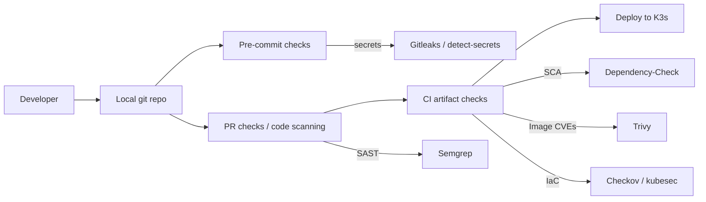

# Lab 7b - Shift-left security pipeline

You will build a local, repeatable security workflow for the nanoservices source repository.

This lab is intentionally explicit:

- You run each stage manually first and interpret output.
- Only after you understand each stage do you compose them into a single runner script.

Environment:

- Ubuntu Server VM
- Docker installed (we run most tools as containers)
- Git repo for the nanoservices (from earlier labs)


## Learning objectives

1) Explain the difference between secrets scanning, SAST, SCA, image CVE scanning, and IaC scanning.
2) Run each tool and interpret at least one real finding (or explain why it is a false positive).
3) Define a gating policy (what fails a build vs what is a warning) and justify it.
4) Implement a simple local pipeline script that produces evidence artifacts under `.reports/`.


## The system you are securing

Your repo contains:

- service source code (Node services, maybe some scripts)
- Dockerfiles for images
- Kubernetes manifests (deployments, services, ingress)

The risk model is practical:

- Secrets can leak into git history
- Known vulnerable dependencies may ship
- Base images may contain OS CVEs
- Kubernetes manifests may introduce unsafe defaults


## Architecture diagram (pipeline view)




## Prerequisites

1) Identify your repo path (example):

```bash
export REPO=~/labs/lab4/compose
cd "$REPO"
git status
```

2) Create a report folder inside the repo:

```bash
mkdir -p .reports
```


## 1. Pre-commit secrets scanning

### What this catches

- Secrets that appear in diffs or committed files (API keys, private keys, tokens).

### Why it matters

- If a secret hits git history, assume compromise. Rotation becomes necessary.

### Tool: Gitleaks (container)

Run against your working tree (no git history required):

```bash
cd "$REPO"
bash ~/lab7/part_b/tools/01_secrets_gitleaks.sh "$REPO"
```

Inspect output:

```bash
ls -la .reports | grep gitleaks
sed -n '1,80p' .reports/gitleaks.json
```

### Exercise: trigger a finding safely

Add a fake secret (do not use a real one):

```bash
echo "API_KEY=sk_test_NOT_REAL_123" >> pricing-fn/.env.example
bash ~/lab7/part_b/tools/01_secrets_gitleaks.sh "$REPO"
```

Now remove it and re-run until clean:

```bash
sed -i '/sk_test_NOT_REAL_123/d' pricing-fn/.env.example
bash ~/lab7/part_b/tools/01_secrets_gitleaks.sh "$REPO"
```

Evidence to capture:

- one report showing detection
- one report showing clean state


## 2. PR-style SAST with Semgrep

### What this catches

- risky code patterns (injection, weak crypto use, unsafely handling input, etc.)

### Why it matters

- Many vulnerabilities are patterns. SAST can catch them before runtime.

Run Semgrep using a small course rule set (customizable):

```bash
cd "$REPO"
cp -v ~/lab7/part_b/samples/semgrep.rules.yaml ./semgrep.rules.yaml
bash ~/lab7/part_b/tools/02_sast_semgrep.sh "$REPO"
```

Inspect output:

```bash
ls -la .reports | grep semgrep
sed -n '1,120p' .reports/semgrep.json
```

Learning task:

- Pick one finding and explain:
  - which file it refers to
  - what the risk is
  - whether it is a true issue or a false positive

---

## 3. SCA (dependencies) with Dependency-Check

### What this catches

- vulnerable third-party libraries (known CVEs) included by your code

### Why it matters

- Most modern apps ship more third-party code than first-party code.

Run Dependency-Check (container). It can be slow and may require outbound access to vulnerability databases:

```bash
cd "$REPO"
bash ~/lab7/part_b/tools/03_sca_dependency_check.sh "$REPO"
```

Inspect reports:

```bash
ls -la .reports | grep dependency-check || true
```

If the scan cannot complete in your VM environment:

- record the error
- explain what evidence you would expect in a successful run
- continue to the next stage (this is common in restricted environments)

---

## 4. Container image CVEs with Trivy

### What this catches

- OS package CVEs and sometimes language dependency CVEs inside images

### Why it matters

- Even perfect app code can ship vulnerable OS packages in its base image.

Build one service image and scan it.

Example (adjust paths to match your repo):

```bash
cd "$REPO"
docker build -t course/pricing-fn:sec ./pricing-fn
bash ~/lab7/part_b/tools/04_image_trivy.sh course/pricing-fn:sec "$REPO"
```

Inspect output:

```bash
sed -n '1,120p' .reports/trivy-course__pricing-fn__sec.txt
```

Learning task:

- Identify one CVE from the report and answer:
  - Is it from the base image OS layer or your app dependencies?
  - What is your likely remediation? (update base image, update dependency, or accept with control)

---

## 5. IaC scanning (Kubernetes YAML) with Checkov and kubesec

### What this catches

- unsafe Kubernetes defaults (privileged containers, no resource limits, running as root, etc.)

Run Checkov and kubesec over your repo:

```bash
cd "$REPO"
bash ~/lab7/part_b/tools/05_iac_checkov.sh "$REPO"
bash ~/lab7/part_b/tools/06_iac_kubesec.sh "$REPO"
```

Inspect outputs:

```bash
ls -la .reports | egrep 'checkov|kubesec' || true
sed -n '1,120p' .reports/checkov.json || true
```

Learning task:

- Choose one IaC finding and fix it in a manifest (example fixes):
  - `allowPrivilegeEscalation: false`
  - `runAsNonRoot: true`
  - `resources.requests/limits`

Re-run the scanner to prove your fix changes the report.

---

## Compose stage - build a simple local pipeline runner

Now that you understand each stage, run the combined script:

```bash
bash ~/lab7/part_b/tools/99_pipeline_all.sh "$REPO"
```

This script is deliberately just a sequential runner that calls the earlier scripts (no hidden behavior).

---

## Deliverables (end of lab)

Submit:

1) `.reports/` directory with:
- gitleaks report
- semgrep report
- checkov + kubesec reports
- trivy report for at least one image
- dependency-check report if it completed (or an error note if it did not)

2) A gating policy (10–15 lines):

- What fails a merge/build in your team?
- What is warning-only?
- Why?
